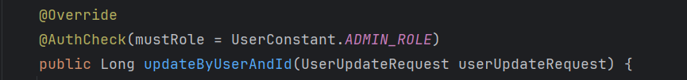
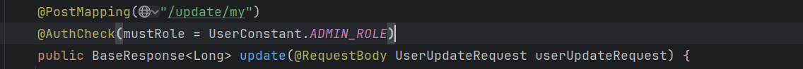
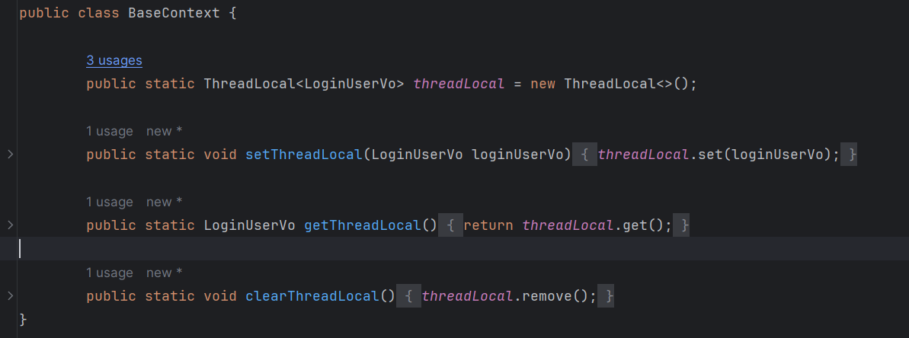

# 图书管理系统

#### 登录

- 基于token进行登录
  - 1. 创建token
    
    ```java
        public String generateToken(String currentUser) {
            String sign = JWT.create()
                    .withClaim(UserConstant.USER_INFO, currentUser)
                    .withIssuedAt(new Date())
                    .withExpiresAt(new Date(System.currentTimeMillis() + EXPIRE_TIME))  // 设置过期时间
                    .withSubject("token")
                    .sign(Algorithm.HMAC256(SIGN_SERCRET));  // 设置签名
            return sign;
        }
    ```
    
    
    
    1. 验证token是否过期
    
    ```java
        public boolean isTokenExpired(String token) {
            try {
                DecodedJWT decodedJWT = JWT.require(Algorithm.HMAC256(SIGN_SERCRET)).build().verify(token);
                return decodedJWT.getExpiresAt().after(new Date());
            } catch (JWTVerificationException e) {
                return false;
            }
        }
    ```
    
    
    
    1. 获取存放在token中的信息
    
    ```java
        public String verifyToken(String token) {
            try {
                JWTVerifier verifier = JWT.require(Algorithm.HMAC256(SIGN_SERCRET)).build();
                Claim claim = verifier.verify(token).getClaim(UserConstant.USER_INFO);
                return claim.asString();
            } catch (JWTVerificationException e) {
                return null;
            }
        }
    ```


#### 使用AOP切面的方式进行权限验证（需求很简单，可能只需要使用 AOP 切面或过滤器。如果你的需求很复杂，可能需要使用安全框架）

- 实现

```java
/**
 * 权限校验
 */
@Target(ElementType.METHOD)
@Retention(RetentionPolicy.RUNTIME)
public @interface AuthCheck {

    /**
     * 必须有某个角色
     *
     * @return
     */
    String mustRole() default "";

}
```

```java

/**
 * 权限校验 AOP
 */
@Slf4j
@Aspect
@Component
public class AuthInterceptor {

    @Resource
    private TokenUtil tokenUtil;

    /**
     * 执行拦截
     *
     * @param joinPoint
     * @param authCheck
     * @return
     */
    @Around("@annotation(authCheck)")
    public Object doInterceptor(ProceedingJoinPoint joinPoint, AuthCheck authCheck) throws Throwable {
        String mustRole = authCheck.mustRole();
        RequestAttributes requestAttributes = RequestContextHolder.currentRequestAttributes();
        HttpServletRequest request = ((ServletRequestAttributes) requestAttributes).getRequest();
        // 当前登录用户
        String token = request.getHeader(UserConstant.AUTHORIZATION);
        String verifyToken = tokenUtil.verifyToken(token);
        LoginUserVo loginUserVo = JSONUtil.toBean(verifyToken, LoginUserVo.class);

        UserRoleEnum mustRoleEnum = UserRoleEnum.getEnumByValue(mustRole);

        // 不需要权限，放行
        if (mustRoleEnum == null) {
            return joinPoint.proceed();
        }
        // 必须有该权限才通过
        UserRoleEnum userRoleEnum = UserRoleEnum.getEnumByValue(loginUserVo.getUserRole());
        if (userRoleEnum == null) {
            throw new BusinessException(ResultErrorCode.NO_AUTH_ERROR);
        }
        // 如果被封号，直接拒绝
        if (UserRoleEnum.BAN.equals(userRoleEnum)) {
            throw new BusinessException(ResultErrorCode.NO_AUTH_ERROR);
        }
        // 必须有管理员权限
        if (UserRoleEnum.ADMIN.equals(mustRoleEnum)) {
            // 用户没有管理员权限，拒绝
            if (!UserRoleEnum.ADMIN.equals(userRoleEnum)) {
                throw new BusinessException(ResultErrorCode.NO_AUTH_ERROR);
            }
        }
        // 通过权限校验，放行
        return joinPoint.proceed();
    }
}
```

- 在需要权限的方法上添加注解






#### 设置全局登录信息




#### 添加过滤器filter进行请求拦截，将需要身份验证的地址进行拦截和不需要的进行放行（包含对swagger的使用）；统一的错误返回响应

```java
package com.ling.librarymanagementsystem.filter;

import cn.hutool.core.util.StrUtil;
import cn.hutool.json.JSONUtil;
import com.ling.librarymanagementsystem.common.BaseContext;
import com.ling.librarymanagementsystem.common.BaseResponse;
import com.ling.librarymanagementsystem.common.ResultErrorCode;
import com.ling.librarymanagementsystem.constant.UserConstant;
import com.ling.librarymanagementsystem.model.entity.User;
import com.ling.librarymanagementsystem.model.vo.LoginUserVo;
import com.ling.librarymanagementsystem.service.UserService;
import com.ling.librarymanagementsystem.utils.TokenUtil;
import lombok.extern.slf4j.Slf4j;

import javax.annotation.Resource;
import javax.servlet.*;
import javax.servlet.annotation.WebFilter;
import javax.servlet.http.HttpServletRequest;
import javax.servlet.http.HttpServletResponse;
import java.io.IOException;

@Slf4j
@WebFilter
public class LoginFilter implements Filter {

    @Resource
    private UserService userService;

    @Resource
    private TokenUtil tokenUtil;

    @Override
    public void doFilter(ServletRequest servletRequest, ServletResponse servletResponse, FilterChain filterChain) throws IOException, ServletException {
        // 从请求头中获取token信息
        HttpServletRequest httpServletRequest = (HttpServletRequest) servletRequest;
        HttpServletResponse httpServletResponse = (HttpServletResponse) servletResponse;

        String url = httpServletRequest.getRequestURI();


        if (isSwaggerRequest(httpServletRequest)) {
            // 如果是，则跳过身份验证
//            doFilter(httpServletRequest, httpServletResponse, filterChain);
            filterChain.doFilter(httpServletRequest, httpServletResponse);
            return;
        }
        // 如果是登录/注册接口，则直接放行
        if (url.contains("login") || url.contains("register")) {
            filterChain.doFilter(httpServletRequest, httpServletResponse);
            return;
        }
        log.info(url);

        String token = httpServletRequest.getHeader(UserConstant.AUTHORIZATION);
        BaseResponse baseResponse = null;
        // 验证token是否存在
        if (StrUtil.isBlank(token)) {
            baseResponse = new BaseResponse(ResultErrorCode.OPERATION_ERROR, "不存在token，请登录");
            sendErrorResponse(httpServletResponse, baseResponse);
            return;
        }

        // 验证token是否过期
        boolean tokenExpired = tokenUtil.isTokenExpired(token);
        if (!tokenExpired) {
            baseResponse = new BaseResponse(ResultErrorCode.OPERATION_ERROR, "token已过期");
            sendErrorResponse(httpServletResponse, baseResponse);
            return;
        }

        // 验证token是否合法
        String verifyToken = tokenUtil.verifyToken(token);
        if (StrUtil.isBlank(verifyToken)) {
            baseResponse = new BaseResponse(ResultErrorCode.OPERATION_ERROR, "token验证失败,请重新登录");
            sendErrorResponse(httpServletResponse, baseResponse);
            return;
        }

        // 从token得到用户信息，并判断用户是否存在，避免后台修改用户信息后，不一致
        LoginUserVo loginUserVo = JSONUtil.toBean(verifyToken, LoginUserVo.class);
        User user = userService.getById(loginUserVo.getId());
        if (user == null) {
            baseResponse = new BaseResponse(ResultErrorCode.OPERATION_ERROR, "用户不存在,请重新登录");
            sendErrorResponse(httpServletResponse, baseResponse);
            return;
        }
        BaseContext.setThreadLocal(loginUserVo);
        filterChain.doFilter(httpServletRequest, httpServletResponse);
    }

    @Override
    public void destroy() {
        BaseContext.clearThreadLocal();
    }

    /**
     * 判断是否是swagger请求
     *
     * @param request
     * @return
     */
    private boolean isSwaggerRequest(HttpServletRequest request) {
        String path = request.getRequestURI();
        return path.startsWith("/swagger")
                || path.startsWith("/v2/api-docs")
                || path.startsWith("/webjars")
                || path.equals("/doc.html")
                || path.startsWith("/swagger-resources");
    }

    /**
     * 发送错误响应
     *
     * @param response
     * @param baseResponse
     * @throws IOException
     */
    private void sendErrorResponse(HttpServletResponse response, BaseResponse baseResponse) throws IOException {
        String json = JSONUtil.toJsonStr(baseResponse);
        response.setContentType("application/json;charset=utf-8");
        response.getWriter().write(json);
    }

}
```